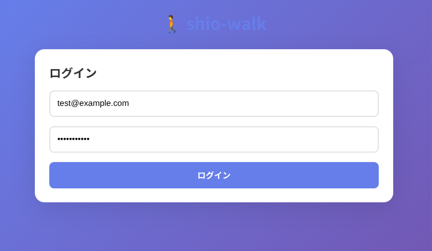

# shio-walk

ウォーキング距離管理アプリ（バックエンド + フロントエンド）
歩数・距離を記録し、到達条件を満たすと報酬（画像・音声）を解放する仕組みを提供します。




---
> ⚠️ IMPORTANT
> 本プロジェクトでは、バックエンドAPIを Single Source of Truth とします。
> フロントエンドでのデータ補正・吸収は禁止し、
> データ不整合は必ず API 実装側で修正する方針を採用しています。
---

## 概要

**shio-walk** はスマートフォン向けウォーキングアプリを想定したフルスタックプロジェクトです。

* ウォークの開始・更新・完了を管理
* 歩数・距離の累計統計を自動更新
* 条件達成時に報酬をアンロック
* JWT 認証によるユーザー管理

現在は **バックエンド API およびフロントエンド（ClojureScript + Re-frame）の基本実装が完了** しており、
ログイン → ダッシュボード表示 → ウォーキング開始 → 状態反映 までの一連の動作が可能です。

一方で、アクティブウォーク中の歩数・距離入力 UI など、一部機能は改善途中です。

---

## 開発状況

### 実装済み

#### バックエンド

* プロジェクト構造作成
* PostgreSQL 環境構築（Docker Compose）
* データベースマイグレーション
* 認証システム（JWT / Buddy）
* ユーザー登録・ログイン API
* ウォーク管理 API（開始・更新・完了）
* 統計情報の自動集計
* 報酬アンロックロジック
* API レスポンス形式の正規化（kebab-case / status 統一）

#### フロントエンド

* ClojureScript + Reagent + Re-frame による SPA 構成
* ログイン / ログアウト UI
* ダッシュボード表示
* ウォーキング開始・状態表示
* 統計情報・報酬一覧表示
* re-frame による状態管理（app-db）

### 既知の未対応・改善予定

* アクティブウォーク中の歩数・距離入力 UI の安定化
* UI/UX 改善
* スマートフォンセンサー連携
* E2E テスト追加

---

## 技術スタック

### バックエンド

* **Language**: Clojure 1.11.1
* **Framework**: Ring + Compojure
* **Server**: Jetty
* **Database**: PostgreSQL 15
* **Auth**: JWT（Buddy）

### フロントエンド

* **Language**: ClojureScript
* **Framework**: Reagent + Re-frame
* **Build Tool**: shadow-cljs
* **State Management**: re-frame

---

## ディレクトリ構成

```text
shio-walk/
├─ backend/
│  ├─ deps.edn
│  ├─ resources/
│  │  └─ migrations/
│  └─ src/shio_walk/
│     ├─ core.clj        ; サーバー起動
│     ├─ routes.clj      ; ルーティング定義
│     ├─ middleware.clj  ; JWT認証など
│     ├─ config.clj      ; 設定（DB接続等）
│     ├─ db.clj          ; DB操作
│     ├─ auth/
│     ├─ walks/
│     └─ rewards/
├─ frontend/
│  ├─ public/
│  │  ├─ index.html
│  │  ├─ css/style.css
│  │  └─ js/
│  │     ├─ main.js
│  │     └─ manifest.edn
│  └─ src/shio_walk/
│     ├─ core.cljs      ; エントリーポイント
│     ├─ db.cljs        ; app-db 定義
│     ├─ events.cljs   ; re-frame events
│     ├─ subs.cljs     ; re-frame subscriptions
│     ├─ api.cljs      ; API 通信層
│     └─ views/
│        ├─ main.cljs
│        ├─ login.cljs
│        └─ dashboard.cljs
├─ images/
└─ README.md
```

---
## 開発メモ・引き継ぎ


- [開発メモ MD](docs/debug-notes.md)
- [デバッグ引き継ぎ手順書 JSON](docs/debugging-handover.json)
- [作業手順書 JSON](docs/playbook.json)
- [開発Step&Plan JSON](docs/step-handover.json)
- [LLM-HandOver JSON](docs/next-llm-handover.json)
- [LLM-cli-worked-report JSON](docs/cli-workedreport.json)
---

## フロントエンド設計メモ

* 状態管理は re-frame を使用
* API は **Single Source of Truth** とする
* フロントエンド側で API のデータ補正は行わない
* ユーザー操作に対しては optimistic update を採用
* 非同期イベントによる state 上書きを防ぐため、イベント責務を明確化

---

## API Specification (v2.0)

この API はフロントエンドにとっての唯一の信頼できる情報源（Single Source of Truth）です。
API 仕様と実装が乖離した場合、フロントエンドでの吸収は禁止し、API 実装側を修正することを原則とします。

（※ 主要エンドポイント・レスポンス例は後述）

---

## 修正履歴（2025-12-18）

* **不具合**: ウォーキング開始ボタンを押しても UI が更新されない問題
* **原因**:

  * API レスポンスのキー形式が不統一（snake_case / kebab-case 混在）
  * `status` 値の不整合
  * re-frame における非同期イベント競合により state が巻き戻る状態競合問題
* **対応**:

  * バックエンド API を正規化（kebab-case / status="active" 統一）
  * `nil` 値を返さない API 契約に変更
  * フロントエンドの state 更新フローを整理
* **設計判断**:

  * フロントエンドで API の不整合を吸収せず、契約境界である API 側を修正する方針を採用

- **補足**: 本問題は単なるAPI不整合ではなく、非同期イベントが競合した際に
  re-frame の state が意図せず上書きされることでUIが巻き戻る「状態競合問題」でもあった。

---

## 既知の問題

* アクティブウォーク中に歩数・距離を直接編集するとエラーが発生する

  * 次ステップで対応予定

---

## 今後の予定

* [ ] アクティブウォーク入力 UI の修正
* [ ] フロントエンドのテスト整備
* [ ] スマートフォンセンサー連携設計
* [ ] デプロイ準備

---

## ライセンス

MIT License

## 2. 設計とデバッグにおける基本方針（引き継ぎ用・超重要）

### このプロジェクトで最も重要な設計原則

本プロジェクトでは、以下の考え方を最優先とする。

#### 1. APIは Single Source of Truth である

フロントエンドは、バックエンドAPIが返すデータを「加工して辻辻を合わせる」ことをしない。
データ形式や値の不整合が発生した場合、原則として **API実装側を修正する**。

#### 2. UI状態は「再計算可能な最小単位」で保持する

re-frame の app-db には、以下を直接保持しない方針を採る。

* APIレスポンスをそのまま複製した状態
* 将来 load API によって上書きされる一時的状態

代わりに：

* 正規化されたリスト（例: `:walks`）
* そこから導出可能な状態（例: `current-walk` は subs で算出）

を基本構造とする。

#### 3. 「一瞬表示されて戻る」UIは、状態競合のサイン

非同期API呼び出し後に UI が一瞬切り替わり、すぐ元に戻る場合、以下の可能性を最優先で疑う。

* optimistic update と load API の競合
* 同一イベント名の二重登録
* derived state と stored state の二重管理

この症状は UI の問題ではなく、**イベント順序・状態設計の問題**であることがほとんどである。

---

## 3. 今回のデバッグから得られた重要な学び（核心）

### 1. optimistic update は「部分的」に使う

今回、`:start-walk` 後に UI が戻る問題の原因は以下だった。

* start-walk で一時的に状態を更新
* 直後に load-walks が古い一覧で上書き

対応として：

* optimistic update は「UI反応を早くするための最小限」に留める
* 最終状態は必ず load API の結果で確定させる

### 2. re-frame で同じ event-id を二重定義すると破滅する

以下の警告は極めて危険なサインである。

```
re-frame: overwriting :event handler for: walks-loaded
```

これは：

* ファイル分割やコピペで同名イベントを複数定義している
* ロード順によって挙動が変わる

という **再現性の低いバグの温床**になる。

→ event-id は「グローバル一意」と認識する。

### 3. 状態を「持つ」か「導出する」かを必ず選ぶ

* ❌ `:current-walk` を db に直接保持
* ⭕ `:walks` から subs で `current-walk` を導出

この切り替えにより：

* API再取得
* 画面リロード
* 非同期競合

すべてに耐える構造になった。

### 4. UIバグの8割は「状態設計」

ボタンが反応しない、表示が戻る、値が消える等の問題は、DOMやCSSではなく **状態の流れ**が原因であることがほとんど。

---

## 補足：API命名規則とフロントエンドでの扱い

> NOTE:
> フロントエンドでは API のレスポンスを直接状態として保持せず、
> 正規化されたコレクション（例: `walks`）から subs により状態を導出する。
> そのため API の命名規則違反や値の不整合は、
> UI 側ではなく API 側で修正することを原則とする。

---
## API memo

## データベース構成

* **users**: ユーザー情報
* **walks**: ウォーキング記録
* **user_stats**: 累計歩数・距離などの統計
* **rewards**: 報酬マスタ
* **user_rewards**: ユーザー獲得済み報酬

### 初期報酬例

* 1000歩: 最初の一歩
* 5000歩: 頑張り屋さん
* 10000歩: ウォーキングマスター
* 1km: 1km走破
* 5km: 5km走破

---

## API エンドポイント

### Public

* `POST /api/auth/register` ユーザー登録
* `POST /api/auth/login` ログイン
* `GET /api/health` ヘルスチェック

### Protected（JWT必須）

* `GET /api/user/profile`
* `POST /api/walks/start`
* `PUT /api/walks/:id`
* `POST /api/walks/:id/complete`
* `GET /api/walks`
* `GET /api/stats`
* `GET /api/rewards`
* `GET /api/rewards/unlocked`

---

## ローカル開発環境構築

### 1. DB 起動

```bash
docker compose up -d
```

### 2. マイグレーション

```bash
cd backend
clj -M:migrate migrate
```

### 3. サーバー起動

```bash
cd backend
DB_USER=shio_user DB_PASSWORD=shiopass DB_NAME=shio_walk clj -M:run
```

または

```bash
./backend/run.sh
```

---

## 動作確認（curl例）

### ユーザー登録

```bash
curl -X POST http://localhost:3000/api/auth/register \
  -H 'Content-Type: application/json' \
  -d '{"email":"test@example.com","username":"testuser","password":"password123"}'
```

### ログイン

```bash
curl -X POST http://localhost:3000/api/auth/login \
  -H 'Content-Type: application/json' \
  -d '{"email":"test@example.com","password":"password123"}'
```

---

## API Specification (v2.0)

このAPIはフロントエンドのための唯一の信頼できる情報源(Single Source of Truth)です。API仕様と実装が乖離した場合、フロントエンドでの吸収は禁止し、API実装側を修正することを原則とします。

### 1. Data Conventions

#### Key Naming
すべてのJSONレスポンスのキーは **`kebab-case`** に統一します。

- **OK**: `:total-steps`
- **NG**: `:total_steps`, `:totalSteps`

#### Primary Keys
すべてのリソースのプライマリキーは **`:id`** に統一します。

- **OK**: `:id`
- **NG**: `:walk-id`, `:reward_id`

#### Status Values
ステータスを表すフィールドは、小文字の文字列で統一します。

- **Walks**: `"active"`, `"completed"`

#### Timestamps
タイムスタンプはすべて **ISO-8601** 形式のUTC文字列で表現します。

- **Example**: `"2025-12-18T12:30:00Z"`

### 2. Authentication
保護されたエンドポイントには、HTTPヘッダーにJWTを含める必要があります。

```
Authorization: Bearer <your-jwt-token>
```

### 3. Endpoint Examples

#### `POST /api/walks/start`
新しいウォーキングセッションを開始します。

- **Response (200 OK)**
  ```json
  {
    "walk": {
      "id": "1e9d1b0a-0b9a-4c1c-9d1b-0a0b9a4c1c9d",
      "user-id": "a1b2c3d4-e5f6-a7b8-c9d0-e1f2a3b4c5d6",
      "start-time": "2025-12-18T10:00:00Z",
      "status": "active",
      "steps": 0,
      "distance-meters": 0
    }
  }
  ```

#### `GET /api/walks`
ユーザーの過去のウォーク履歴を取得します。

- **Response (200 OK)**
  ```json
  {
    "walks": [
      {
        "id": "1e9d1b0a-0b9a-4c1c-9d1b-0a0b9a4c1c9d",
        "user-id": "a1b2c3d4-e5f6-a7b8-c9d0-e1f2a3b4c5d6",
        "start-time": "2025-12-18T10:00:00Z",
        "end-time": "2025-12-18T10:45:00Z",
        "status": "completed",
        "steps": 5231,
        "distance-meters": 3800
      }
    ]
  }
  ```

#### `GET /api/rewards`
すべての報酬マスタリストを取得します。

- **Response (200 OK)**
  ```json
  {
    "rewards": [
      {
        "id": "f4c2e1d1-c2b3-4a5e-b6c7-d8e9f0a1b2c3",
        "title": "最初の一歩",
        "description": "初めてのウォーキングを記録する",
        "threshold-type": "walks",
        "threshold-value": 1,
        "image-url": null,
        "audio-url": null
      },
      {
        "id": "a1b2c3d4-e5f6-a7b8-c9d0-e1f2a3b4c5d6",
        "title": "1000歩達成",
        "description": "1回のウォークで1000歩を達成する",
        "threshold-type": "steps",
        "threshold-value": 1000,
        "image-url": null,
        "audio-url": null
      }
    ]
  }
  ```

#### `GET /api/rewards/unlocked`
ユーザーが獲得した報酬のリストを取得します。

- **Response (200 OK)**
  ```json
  {
    "rewards": [
      {
        "id": "f4c2e1d1-c2b3-4a5e-b6c7-d8e9f0a1b2c3",
        "title": "最初の一歩",
        "description": "初めてのウォーキングを記録する",
        "threshold-type": "walks",
        "threshold-value": 1,
        "image-url": null,
        "audio-url": null,
        "unlocked-at": "2025-12-18T10:45:00Z"
      }
    ]
  }
  ```

---

## 修正履歴（2025-12-18）

- **不具合**: ウォーキング開始ボタンを押してもUIが更新されない問題、およびリスト表示で`:key`警告が多発する問題。
- **原因**: バックエンドAPIが返すJSONのデータ形式が不統一だったため。
  - `start-walk` APIが `status: "in_progress"` を返していた。
  - レスポンスのキーが `snake_case` と `kebab-case` が混在していた。
  - 一部のデータで `:id` が `nil` になっていた。
  - これらのデータの不整合が原因で、フロントエンドのre-frameが状態を正しく認識・更新できず、UIの再描画が失敗していた。
- **対応**: APIを「唯一の信頼できる情報源」と位置づけ、バックエンドのレスポンスを正規化。
  - すべてのAPIレスポンスのキーを `kebab-case` に統一。
  - `start-walk` APIは必ず `status: "active"` を返すように修正。
  - `id` が `nil` のデータはAPIレスポンスから除外。
  - `distance-meters` などの数値が `nil` にならないようデフォルト値 `0` を設定。
  - 上記の前提に基づき、フロントエンドのデータ吸収ロジックを削除・単純化。
- **設計判断**: 将来の保守コストを最小化するため、フロントエンド側でAPIの不整合を吸収するのではなく、契約境界であるバックエンドAPI側を修正するアプローチを選択。これにより、フロントエンドは受け取ったデータをそのまま信頼して使用できるようになった。

---

## 既知の問題と対応履歴

* **DB認証失敗**: HikariCP が `:user` を認識しない

  * 対応: `config.clj` に `:username` を追加

* **ユーザー登録時エラー**: `execute-one!` が単一アリティ

  * 対応: DB関数をマルチアリティ化

---


> [!NOTE]
> ##### 編集メモ
> エクスクラメーションマークを行頭に付けるとアクティブに
```

```
