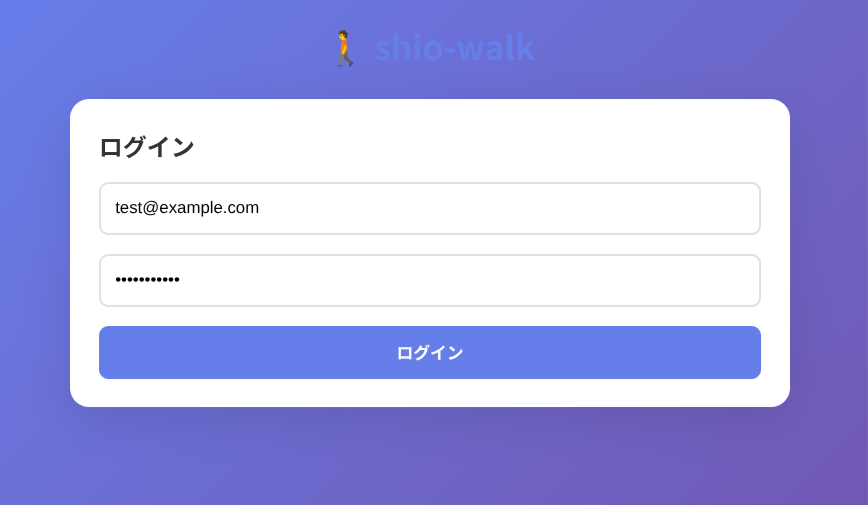
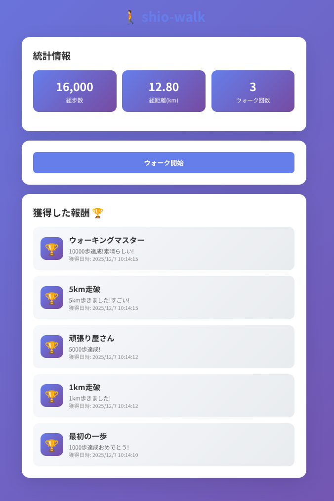

# shio-walk

ウォーキング距離管理アプリ（バックエンド + フロントエンド）
歩数・距離を記録し、到達条件を満たすと報酬（画像・音声）を解放する仕組みを提供します。

> [!IMPORTANT]
> 本プロジェクトでは、バックエンドAPIを Single Source of Truth とします。
> フロントエンドでのデータ補正・吸収は禁止し、
> データ不整合は必ず API 実装側で修正する方針を採用しています。

## 概要

**shio-walk** はスマートフォン向けウォーキングアプリを想定したフルスタックプロジェクトです。

* ウォークの開始・更新・完了を管理
* 歩数・距離の累計統計を自動更新
* 条件達成時に報酬をアンロック
* JWT 認証によるユーザー管理
* **PWA 対応**: ホーム画面追加、オフライン動作、スマートフォンセンサー連携

現在は **全ての主要機能の実装が完了** しており、実機（iPhone Safari）での動作確認も済んでいます。

---

## 開発状況

### 実装済み

#### PWA / センサー連携 (New!)

* **PWA 対応**: ホーム画面追加、オフラインキャッシュ（Service Worker）
* **センサー計測**: 加速度センサー（歩数）および GPS（距離）のリアルタイム連携
* **iOS Safari 互換性**: ユーザー操作に同期したセンサー起動、バックグラウンド制限を考慮した自動同期ロジック
* **データ同期**: 3分おきの定期保存、および画面復帰時の即時同期（VisibilityChange）
* **安全設計**: 完了ボタン押下時の自動最終保存、セッション終了時の状態リセット

#### バックエンド

* PostgreSQL 環境構築（Docker Compose）
* 認証システム（JWT / Buddy）
* ウォーク管理 API（開始・更新・完了）
* 統計情報の自動集計および報酬同期ロジック
* API レスポンス形式の正規化（kebab-case / status 統一）

#### フロントエンド

* ClojureScript + Re-frame による SPA 構成
* ダッシュボード表示（統計情報の 2列グリッド化、履歴の折りたたみ表示）
* リアルタイムセンサー計測 UI（センサーモードをデフォルト化）
* 手動入力の安定化（ローカル atom によるスムーズな数値入力）

---

## スマートフォン実機での利用（PWA / センサー）

### 動作環境
* **iOS**: Safari (推奨)
* **Android**: Chrome

> [!CAUTION]
> iOS の Chrome や LINE 内ブラウザでは、Apple の制限により加速度センサー（歩数計）が動作しません。必ず **Safari** を使用してください。

### iOS Safari での準備
1. **SSL証明書の信頼**: 自宅サーバーの IP アドレス（例: `https://192.168.171.12:3443/api/health`）にアクセスし、自己署名証明書を信頼してください。
2. **センサー権限の許可**: 
   * アプリ内の「ウォーキング開始」ボタンをタップした際に出る許可ダイアログで「許可」を選択してください。
3. **ホーム画面に追加**: Safari の共有メニューから「ホーム画面に追加」を行うことで、フルスクリーンアプリとして利用可能です。

---

## 技術スタック

### バックエンド
* **Clojure**: Ring + Compojure, Jetty, PostgreSQL, Buddy(JWT)

### フロントエンド
* **ClojureScript**: Reagent + Re-frame, shadow-cljs

---

## 今後の予定

* [x] アクティブウォーク入力 UI の修正
* [ ] フロントエンドのテスト整備
* [x] スマートフォンセンサー連携設計・実装
* [ ] 本番環境へのデプロイ準備（正式な証明書・ドメイン）
* [ ] スリープ防止（Wake Lock API）の調査

---

## 修正履歴（2026-03-08）
* **iOS Safari センサー対応**: ユーザー操作（クリック）に同期したセンサー起動への変更。
* **データ同期の堅牢化**: 3分おきの自動同期、画面復帰時の即時同期、完了時の自動最終保存を実装。
* **UI/UX 改善**: 統計パネルの 2列化、履歴の折りたたみ表示、手動入力の安定化。
* **バグ修正**: 手動入力値が完了時に 0 に上書きされる問題を、参照先を `:current-walk` に一本化することで解消。

---

## ライセンス
MIT License
